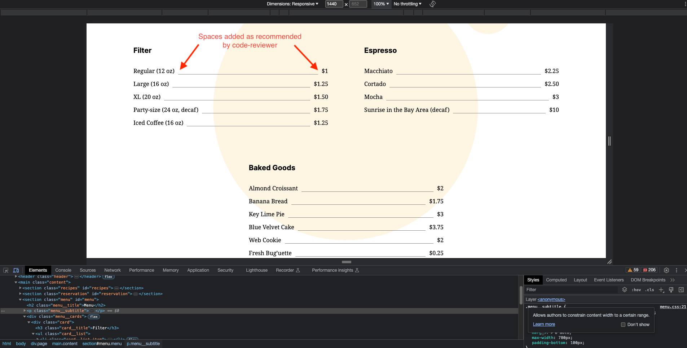
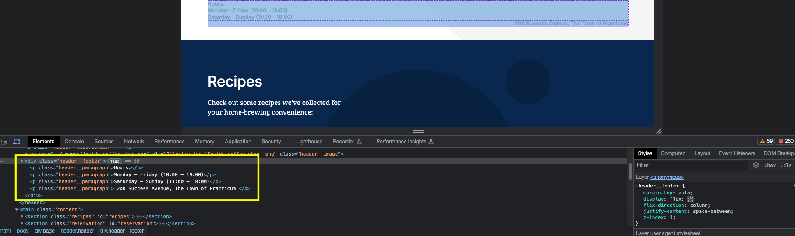
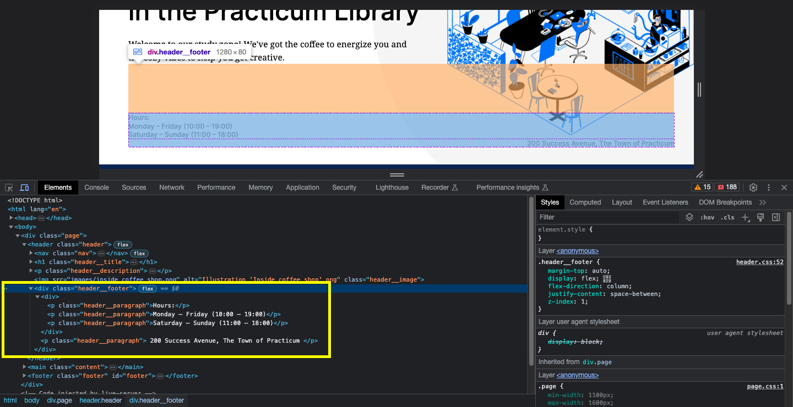
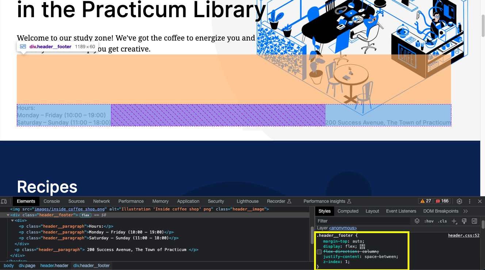

# Practicum Coffee Shop

This is the second project of the Web Development program at Triple Ten, formerly Practicum. It was created using HTML and CSS, based on the design brief.

## Project features

- Semantic HTML5
- Flexbox
- Positioning
- Flat BEM
- A custom form
- CSS animation and transform

## Plan on improving the project

- Use z-index to keep title and title description above the image for smaller screens
- Have title and description wrap for smaller screens
- Learn how to add images and gifs to readme file

## Corrections

- Added spaces between name and price as suggested by code-reviewer
  

- Divided header-footer into appropriate paragraphs and used `align-self: flex-end;` so that the address appears below the image
  

- HTML validator showed no errors

- Created 
 tag for the hours section
  

- Proper alignment according to the brief
  

- Removed spaces in screenshot filenames to follow best practice according to MDN
